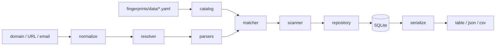
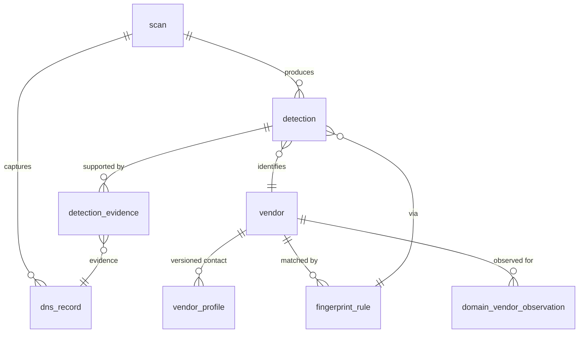

# site-b2b-intel

Identify the SaaS vendors a company uses from its public DNS records. Give it a domain; it reports the vendors it can detect, the exact DNS signal that proved each one, and how long that vendor has been observed there.

No scraping, no HTTP requests, no JavaScript execution. Every signal comes from records the domain already publishes to every recursive resolver on the internet.

```console
$ b2b-intel scan figma.com
✓ figma.com → 13 vendors (scan #2)
```

## Why

DNS leaks a lot of operational detail. Which email provider a company uses, which CDN and DNS host they trust, which SaaS products they have verified themselves to, which certificate authorities they authorize, and which vendor processes their DMARC reports — all of it is public, and none of it is aggregated anywhere convenient.

Wappalyzer's open forks (`tunetheweb/wappalyzer`, `enthec/webappanalyzer`, `projectdiscovery/wappalyzergo`) are HTTP/HTML-focused and treat DNS as a secondary signal. This tool goes the other way: DNS is the whole surface, examined properly.

## Install

Requires Python 3.12+ and [uv](https://docs.astral.sh/uv/).

```bash
git clone git@github.com:junxit/site-b2b-intel.git
cd site-b2b-intel
uv sync
uv run b2b-intel init
```

`init` creates the database at `~/.local/share/b2b-intel/b2b-intel.db` and seeds the vendor catalog. Override the location with `B2B_INTEL_DB_PATH`; see `.env.example` for all settings.

## Usage

```bash
# Scan one domain
uv run b2b-intel scan stripe.com

# Human-readable report with first/last-seen history
uv run b2b-intel report stripe.com

# Machine-readable, for pipelines
uv run b2b-intel scan stripe.com --format json | jq '.results[0].vendors[].slug'

# Batch scan into a single CSV, one row per detection signal
uv run b2b-intel scan -f domains.txt --format csv > results.csv

# The inverse question: who uses this vendor?
uv run b2b-intel vendors domains cloudflare --since 2026-01-01
```

Progress output goes to stderr whenever `--format` is `json` or `csv`, so stdout stays pipeable.

### Commands

| Command | What it does |
|---|---|
| `init` | Create the DB, apply the schema, seed vendors + rules from YAML. Idempotent. |
| `scan <domain>` | Resolve, match, persist. Accepts a domain, URL, or email address. |
| `scan -f <file>` | Batch scan, one domain per line. `#` comments allowed. |
| `scan --no-probe` | Skip CNAME subdomain probing — roughly halves scan time. |
| `scan --include-records` | Include every raw DNS record in JSON output. |
| `report <domain>` | Latest scan for a domain, with first/last-seen per vendor. |
| `vendors list` | All vendors in the catalog. |
| `vendors show <slug>` | One vendor's profile and its rules. |
| `vendors domains <slug>` | Which scanned domains use this vendor. Supports `--limit`, `--since`. |
| `rules list` | Active fingerprint rules. `--all` includes soft-deleted. |
| `rules validate` | Check the YAML catalog for unreachable rules and undetectable vendors. |
| `reseed` | Re-apply the YAML catalog after editing it. |

`scan`, `report` and `vendors domains` all accept `--format {table,json,csv}`.

## Detection signals

The catalog currently ships **50 vendors** and **106 rules**. Counts below are live — `rules validate` prints them.

| Record | Rules | What it identifies |
|---|---:|---|
| `TXT` | 14 | Domain-verification tokens: `google-site-verification=`, `MS=`, `docusign=`, `atlassian-domain-verification=`, `facebook-domain-verification=`, `apple-domain-verification=`, `stripe-verification=`, `adobe-idp-site-verification=`, `shopify-verification-code=`, … |
| `SPF` | 16 | `include:` / `redirect=` targets → Google Workspace, Microsoft 365, Mailgun, SendGrid, Mailchimp, Salesforce, AWS SES, HubSpot, Zendesk, Marketo, Proofpoint, Mimecast, Campaign Monitor |
| `NS` | 16 | DNS provider → Cloudflare, Route 53, Akamai, NS1, Google Cloud DNS, Azure DNS, DNSimple, Fastmail, Zoho, Proton |
| `MX` | 13 | Email provider → Google Workspace, Microsoft 365, Proofpoint, Mimecast, Fastmail, Proton Mail, Zoho, Mailgun, SendGrid |
| `DMARC_RUA` | 13 | `rua=` mailbox domain → dmarcian, Valimail, Agari, EasyDMARC, Proofpoint, Red Sift OnDMARC, EmailAnalyst, Validity Everest |
| `CNAME` | 13 | Probed subdomains → Statuspage, Shopify, Zendesk, Intercom, Vercel, Netlify, Akamai, Cloudflare, Greenhouse, Marketo |
| `CAA_ISSUER` | 11 | Authorized certificate authority → Let's Encrypt, DigiCert, Sectigo, GlobalSign, Google Trust Services, Amazon, SSL.com |
| `DKIM_SELECTOR` | 9 | Selector name → Google Workspace, Microsoft 365, Mailchimp, SendGrid |
| `AWSSES_VERIFY` | 1 | `_amazonses.<domain>` exists → AWS SES |

Record types prefixed with a synthetic name (`SPF`, `DMARC_RUA`, `DKIM_SELECTOR`, `CAA_ISSUER`, `AWSSES_VERIFY`) are derived by the scanner from a resolved record's contents, so a rule can match one meaningful token instead of re-parsing a compound string. The raw record is always stored alongside anything derived from it.

### Scan cost

A default scan is roughly **34 DNS queries**: 6 at the apex, 11 DKIM selectors, `_dmarc`, `_amazonses`, and 15 CNAME subdomain probes. At the default 5 queries/sec that is about 7 seconds per domain.

`--no-probe` drops the CNAME probes, taking it to ~19 queries and about 4 seconds. Behavior is otherwise identical between single and batch scans — an implicit "batch is faster" rule would mean the same domain yields different vendor lists depending on how it was scanned, which would quietly corrupt the adoption history.

## How detection works



Module dependencies flow strictly downward; nothing in `db/` imports from `scan/` or `fingerprints/`. The matcher is a pure function with no signal-specific branches, and all three output formats render from one payload builder so they cannot drift apart.

## Data model



Schema lives in `src/site_b2b_intel/db/schema.sql` and is applied directly on connection. `db/migrations/0001_init.sql` is kept as a versioned record of the initial schema; there is no migration runner yet.

`domain_vendor_observation` tracks `first_seen` / `last_seen` per (domain, vendor) across every scan, which is what makes adoption history possible without a paid historical-DNS API — re-scan over time and the record builds itself.

## Extending the catalog

Vendors and rules are authored in YAML under `src/site_b2b_intel/fingerprints/data/`.

1. Add the vendor to `vendors.yaml` and at least one rule to the appropriate `rules/*.yaml`.
2. Run `uv run b2b-intel rules validate`.
3. Run `uv run b2b-intel reseed`.

Rules removed from YAML are soft-deleted (`enabled=0`) rather than dropped, so historical detections still resolve back to the rule that produced them.

**Verify patterns against real DNS before adding them.** Every pattern in this catalog was read off a live record rather than recalled, and that process caught five that would have been wrong: Statuspage publishes as `stspg-customer.com` (not `statuspage.io`), Valimail as `vali.email`, EasyDMARC as `rua.easydmarc.us`, Google Trust Services as `pki.goog`, and Comodo as `comodoca.com`. A rule written from memory does not fail loudly — it simply never matches.

Write suffix rules with a leading dot (`.zendesk.com`), pairing with a separate `exact` rule when the apex is itself a valid value. Bare `suffix: zendesk.com` also matches an attacker-registered `fakezendesk.com`. `rules validate` enforces this.

## Development

```bash
uv sync
uv run pytest              # full suite
uv run pytest tests/unit   # fast, pure-function tests only
uv run pytest -k spf
```

The suite runs entirely offline. `tests/integration/test_scanner.py` defines a `FakeResolver` that replays canned `(name, record_type)` answers, so no test makes a DNS query.

## Limitations

- **TXT verification tokens are sticky.** They routinely outlive the integration that created them, so a detection means "has verified this domain with vendor X at some point", not necessarily "uses X today". `vendors domains --since` exists for this reason.
- **CNAME coverage is partial.** Detection requires a CNAME at one of the 15 probed subdomains. Companies fronting everything with A records, or using CNAME flattening, will show fewer CNAME detections regardless of what they actually run.
- **Absence is not evidence.** A vendor not detected may simply leave no DNS trace. Plenty of SaaS is invisible at the DNS layer entirely.
- **No historical backfill.** History accrues only from your own repeated scans; there is no import from a historical-DNS archive.

## Roadmap

- HTTP header and HTML signal sources behind the same matcher abstraction
- TLS certificate and WHOIS signals
- Aggregate adoption snapshots across the scanned corpus
- Optional ingestion from historical-DNS archives via backdated scan rows
- Async batch scanning once volume warrants it

## License

Proprietary. Copyright © 2026 Jade Naaman. All rights reserved. See [LICENSE](LICENSE).

This repository is source-available for reference and review. It is not open source, and no license to use, copy, modify, or distribute the software is granted.
