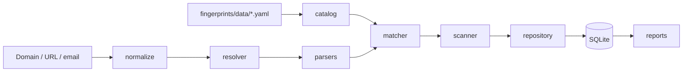
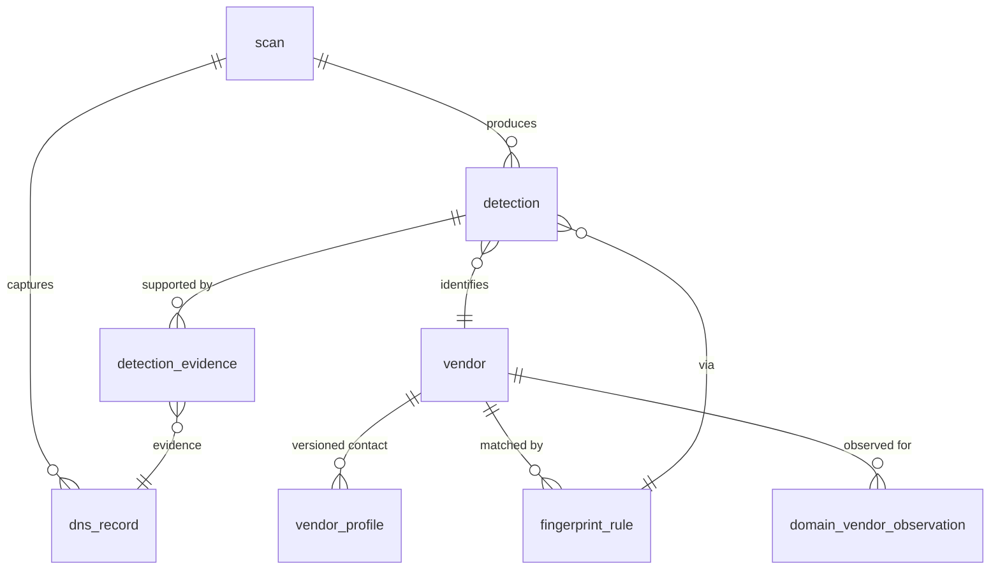

# site-b2b-intel

DNS-based B2B vendor intelligence. Given a domain, identifies the SaaS vendors the company uses by analyzing its public DNS records (TXT verification tokens, MX, NS, SPF, DMARC, DKIM, CAA, CNAME). Persists results in SQLite so vendor adoption can be tracked over time.

## Why

A company's DNS records leak a lot of operational signal: which email provider they use, which CDN/DNS host they trust, which SaaS apps they've verified themselves to, even which DMARC vendor processes their reports. All of this is public — published to every recursive resolver on the internet — but no maintained open-source library aggregates it into a clean "domain → vendor list" view. Wappalyzer's open forks (`tunetheweb/wappalyzer`, `enthec/webappanalyzer`, `projectdiscovery/wappalyzergo`) are all HTTP/HTML-focused and treat DNS as a secondary signal.

This tool fills that gap. It is intended as a research pipeline first, with a long-term path to publishing aggregated vendor adoption data.

## Quick start

```bash
uv sync
uv run b2b-intel init             # create DB and seed vendors + rules
uv run b2b-intel scan stripe.com  # scan a domain
uv run b2b-intel report stripe.com
```

The database lives at `~/.local/share/b2b-intel/b2b-intel.db` by default; override with `B2B_INTEL_DB_PATH`.

## Architecture



Module dependencies flow strictly downward; nothing in `db/` imports from `scan/` or `fingerprints/`.

## Data model



Schema lives in `src/site_b2b_intel/db/schema.sql`. Fingerprint rules and vendor metadata are authored in YAML under `src/site_b2b_intel/fingerprints/data/` and synced into the DB by `b2b-intel init` / `b2b-intel reseed`.

## CLI

| Command | What it does |
|---|---|
| `b2b-intel init` | Create DB at the configured path, apply migrations, seed vendors + rules from YAML. Idempotent. |
| `b2b-intel scan <domain>` | Resolve DNS, persist scan + records, run matcher, persist detections. |
| `b2b-intel scan -f domains.txt` | Batch scan one domain per line. |
| `b2b-intel report <domain>` | Show the latest scan as a Rich table with vendor, first_seen, last_seen, evidence. |
| `b2b-intel vendors list` | List all known vendors. |
| `b2b-intel vendors show <slug>` | Show a vendor's profile + rules. |
| `b2b-intel rules list` | List active fingerprint rules. |
| `b2b-intel reseed` | Re-apply the YAML catalog (soft-deletes removed rules). |

## Detection signals

DNS-only at MVP, pluggable for HTTP / TLS / WHOIS later.

| Record type | What we detect |
|---|---|
| `TXT` (root) | Verification tokens: `google-site-verification=`, `MS=`, `docusign=`, `atlassian-domain-verification=`, `facebook-domain-verification=`, `apple-domain-verification=`, `stripe-verification=`, `pinterest-site-verification=`, `adobe-idp-site-verification=`, `_amazonses.`, `shopify-verification-code=`, … |
| `TXT` (SPF) | `include:` and `redirect=` directives → email-sending providers (Google Workspace, Microsoft 365, Mailgun, SendGrid, Mailchimp, Salesforce, AWS SES, …) |
| `TXT` (DMARC) | `rua=` mailbox domain → DMARC vendor (dmarcian, Valimail, Agari, EasyDMARC, Postmark, …) |
| `TXT` (DKIM) | Selectors: `google._domainkey`, `selector1/2._domainkey` (O365), `k1._domainkey` (Mailchimp), `s1._domainkey` (SendGrid), `mandrill._domainkey`, `smtpapi._domainkey`, … |
| `MX` | Email provider — Google Workspace (`aspmx.l.google.com`), Microsoft 365 (`*.mail.protection.outlook.com`), Proofpoint, Mimecast, Mailgun, Fastmail, Zoho, ProtonMail |
| `NS` | DNS provider — Cloudflare, Route53, Google Cloud DNS, Azure DNS, NS1, Dyn, DNSimple, Akamai |
| `CAA` | Cert issuer — Let's Encrypt, DigiCert, Amazon, Sectigo, Google Trust Services, Comodo |
| `CNAME` | SaaS endpoints — `*.myshopify.com`, `*.hubspot.net`, `*.zendesk.com`, `*.salesforce.com`, `*.intercom.io`, `*.statuspage.io`, … |

## Development

```bash
uv sync                      # install runtime + dev deps
uv run pytest                # run tests
uv run pytest tests/unit     # fast unit tests only
uv run pytest -k spf         # run a subset
```

Tests use recorded DNS fixtures in `tests/fixtures/dns/` (wire format via `dns.message.from_wire`) so the suite runs offline.

### Adding a vendor or rule

1. Edit `src/site_b2b_intel/fingerprints/data/vendors.yaml` (vendor + profile) and the appropriate `rules/*.yaml`.
2. `uv run b2b-intel reseed` — pushes YAML into the DB. Removed rules are soft-deleted (`enabled=0`) so historical detections still resolve.

## Roadmap

- HTTP header + HTML signal detectors behind the same matcher abstraction.
- TLS certificate + WHOIS signals.
- `vendor_adoption_snapshot` materialized table — the monetization view.
- FastAPI web UI for browsing scan results.
- External archive ingestion (SecurityTrails, etc.) via backdated `scan.scanned_at` inserts.
- Async batch scanner once volume warrants it.

## License

TBD.
